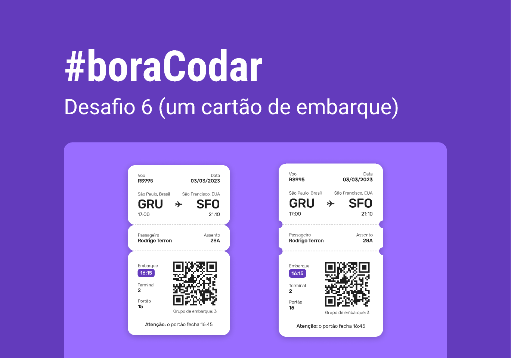

<h1 align="center"> #boraCodar uma cartão de embarque. </h1>

Programa exclusivo e gratuito, promovido pela Rocketseat para ensino de tecnologias WEB.  

  <a href="#-tecnologias">Tecnologias</a>&nbsp;&nbsp;&nbsp;|&nbsp;&nbsp;&nbsp;
  <a href="#-projeto">Projeto</a>&nbsp;&nbsp;&nbsp;|&nbsp;&nbsp;&nbsp;
  <a href="#-layout">Layout</a>&nbsp;&nbsp;&nbsp;|&nbsp;&nbsp;&nbsp;
  <a href="#memo-licença">Licença</a>

  

 

  

## 🚀 Tecnologias

Esse projeto foi desenvolvido com as seguintes tecnologias:

- HTML e CSS 
- Git e Github
- Figma

## 💻 Projeto

Este projeto faz parte de uma séries de desafios proposto pela [Rocketseat!](https://rocketseat.com.br) com o intuito de ajudar a criar um portfólio completo, e ainda impulsionar a praticar programação toda semana.

- [Acesse o projeto finalizado, online]()

## 🔖 Layout

Você pode visualizar o layout do projeto através [DESSE LINK](https://www.figma.com/community/file/1205146101173113980). É necessário ter conta no [Figma](https://figma.com) para acessá-lo.

## :memo: Licença

Esse projeto está sob a licença MIT.

---

Feito com ♥ by Rocketseat, codado pelo [pedro](https://github.com/peulearning) :wave: [Participe da nossa comunidade!](https://discord.gg/rocketseat)
